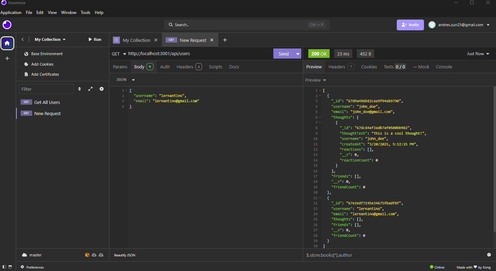
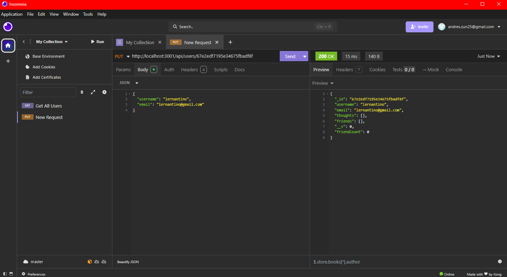
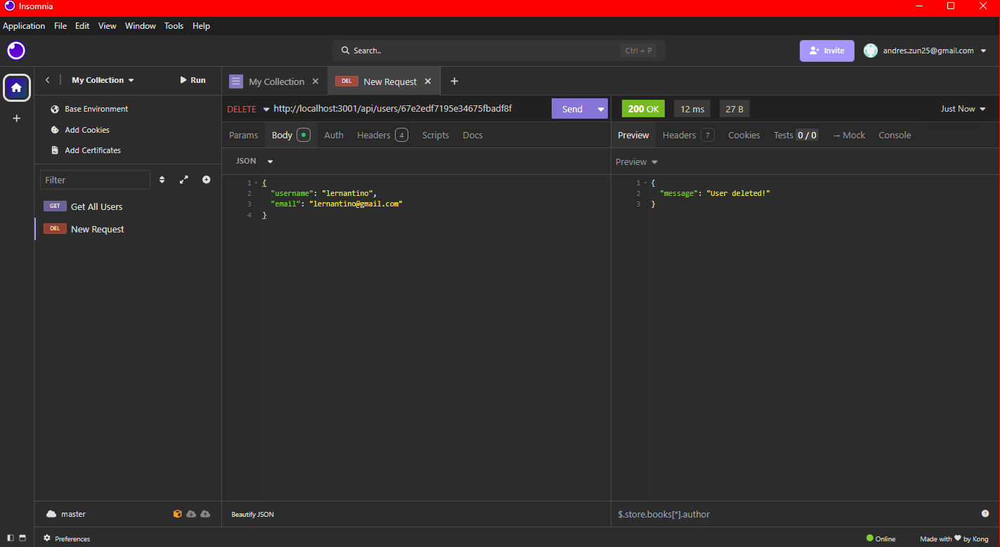
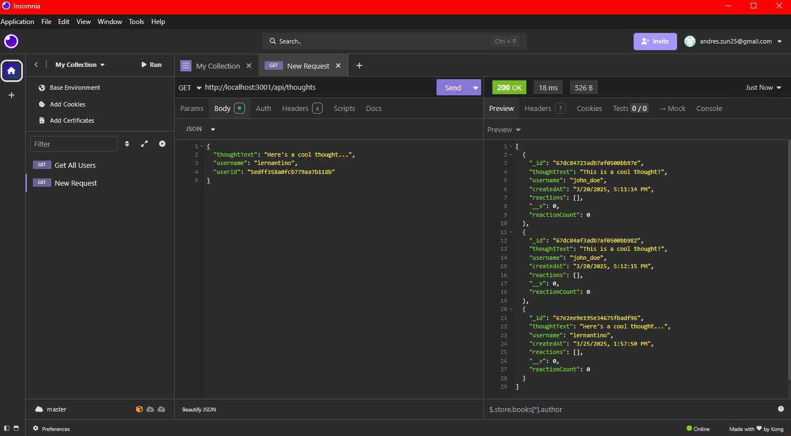
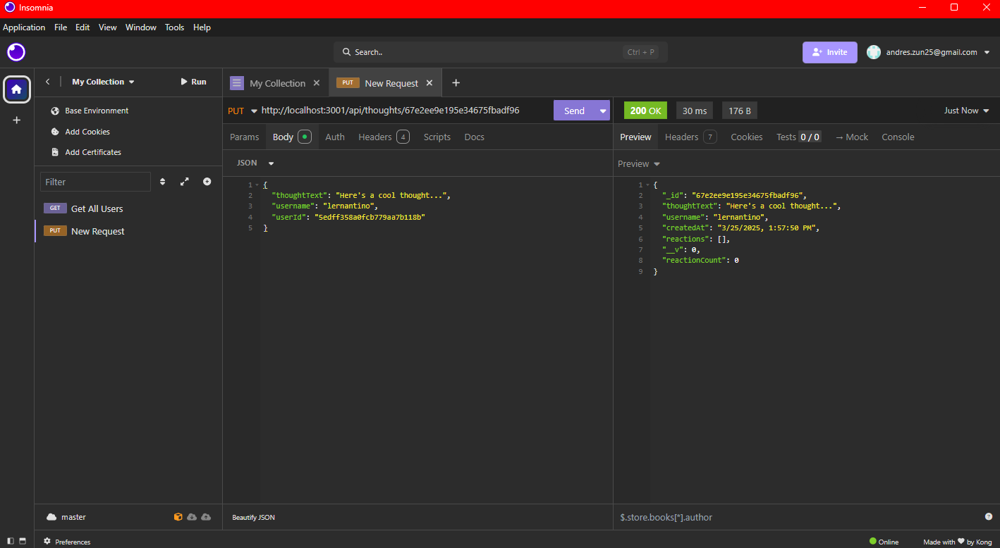
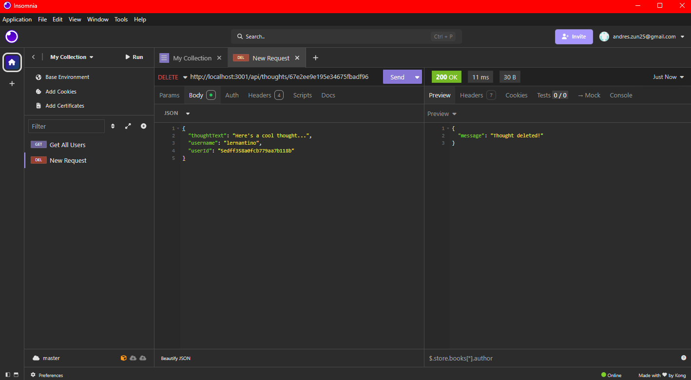

# Social Network API  Module-18

# Description

This is Social Network API designed to manage user data, thoughts, reactions, and friend connections using Express.js, MongoDB, and the Mongoose ODM. It allows users to perform CRUD operations (Create, Read, Update, Delete) on Users, Thoughts, Reactions, and Friends. This application efficiently handles database interactions and provides structured API endpoints that can be tested using Insomnia.

# Acceptance Criteria

GIVEN a functional Express.js API

WHEN I enter the command to invoke the application

THEN my server is started and the Mongoose models are synced to the MongoDB database

WHEN I open API GET routes in Insomnia for users and thoughts

THEN the data for each of these routes is displayed in a formatted JSON

WHEN I test API POST, PUT, and DELETE routes in Insomnia

THEN I am able to successfully create, update, and delete users and thoughts in my database

WHEN I test API POST and DELETE routes in Insomnia

THEN I am able to successfully create and delete reactions to thoughts and add and remove friends to a user’s friend list

# Installation

1. Clone the starter code to your repository
2. Open in VS Code
3. Create a .env file 
4. add your MongoDB connection string 
5. Start your MongoDB server 
6. Seed your database 
7. run npm i
8. then npm run dev
9. Open Insomnia test the routes in the acceptence criteria 
10. after git add .
11. git commit -m 
12. git push origin main
13. Create a walkthrough video 

here is the video to showcase
https://app.screencastify.com/v3/watch/n5cJ66knV4nxynJOIyU9 

# users

# thoughts

